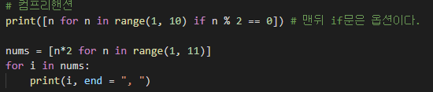
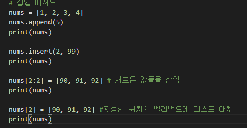
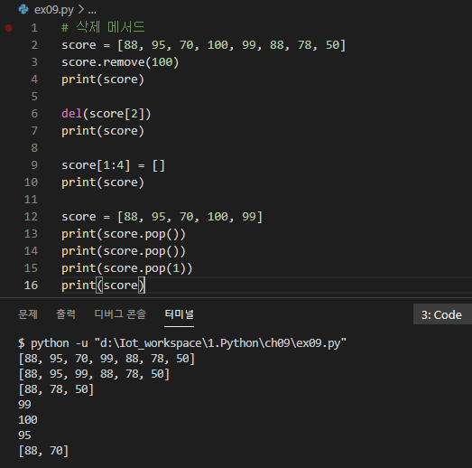
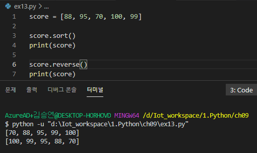
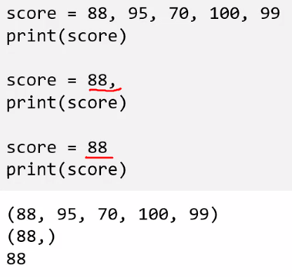
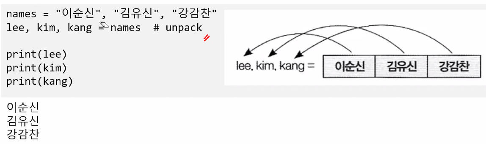
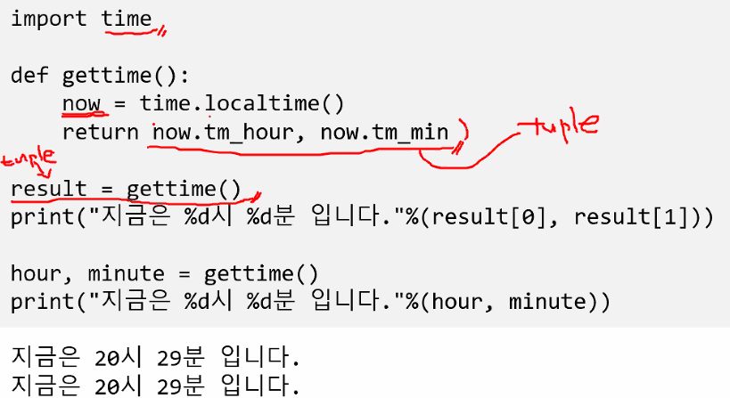

# PyThon

## 변수

### 기본구조 

* 들여쓰기 매우 중요
* 대소문자 구분
* 출력 => print(출력 내용 [, sep = 구분자] [, end = 끝 문자])
* sep의 default 는 ,이고 end의 default는 \n이다.

#### 입력 

* 변수 = input("질문내용")
* input 함수는 "문자열" 타입으로 리턴 (즉 숫자로 리턴받기 위해선 int로 형변환 필요)

#### 변수

* 값을 저장하고 있는 메모리에 대한 명칭
* 알파벳, 밑줄, 숫자로 구성
* 첫 글자로 숫자는 사용 불가
* 대소문자를 구분
* 키워드 사용 불가
* 파이썬 변수는 값의 타입이 고정되어 있지 않음. (대부분의 다른 언어는 고정)
* 어떠한 값이든 대입 가능
* 선언되지 않은 변수 또는 삭제된 변수를 읽으면 예외사항 발생 (에러)

## 타입

### 정수형

* 크기에 제한이 없음

* 값에 따라 크기가 자동으로 조정됨.

* 진법에 따라 표기 및 해석

* | 진법   | 접두 | 사용 가능한 숫자 | 예     |
  | ------ | ---- | ---------------- | ------ |
  | 16진법 | 0x   | 0~9, a~f         | 0x2f   |
  | 8진법  | 0o   | 0~7              | 0o17   |
  | 2진법  | 0b   | 0, 1             | 0b1101 |

### 실수형

* float() 사용

### 복소수형

* 실수부 + 허수부j

### 문자열

* 큰 따옴표("), 작은 따옴표(')로 묶음 (한줄 표현)
* 삼중 따옴표(""") 가능 (여러줄 표현)
* 여는 따옴표와 닫는 따옴표가 동일해야 함
* 따옴표 안에 동일한 따옴표는 사용하지 못함

#### 문자열 확장

* 개행 문자와 같은 특수 문자를 표기하는 방법 (\ 사용)

#### 문자 코드

## 그 외의 타입

### 진위형(불린)

* True, False  두 가지 값만 가짐.

### None

* 어떠한 값도 없음을 나타냄

### List, Tuple

* 
* Tuple은 읽기전용이다.

## 연산자

### 대입 연산자 ( = )

* 어떠한 값을 변수에 저장하는 것
* 직접 값을 지정
* 연산의 결과를 값으로 사용
* 사용하지 않는 변수를 읽으면 예외 발생

### 산술 연산자

* +, -, *, / 
* ** 거듭제곱, // 정수 나누기, %나머지

### 복합 대입 연산자

* 변수의 반복 사용을 줄여 주는 축약 표현
* a += 1 == ( a = a + 1 )

## 함수

### 함수

* 반복되는 코드 - 함수로 정의하여 반복을 없앰

### 인수

* 함수로 값을 전달했을 때 이를 저장하는 변수
* 리턴값 : 함수의 실행결과를 호출한 곳으로 넘기는 값
* 함수 호출시 인수가 지정되지 않았을 때 사용할 값
* 함수 정의시 인수에 값을 대입
* 인수 목록의 마지막 부분에 배정
* 중간에 배정시 구분 불가

### 가변인수

* 인수의 수가 고정되지 않음
* 호출시 원하는만큼 인수를 지정
* 함수에서는 이를 튜플 변수로 받음
* 일반 인수 뒤에만 올 수 있음
* 하나만 사용 가능
* 

### 지역변수

* 함수 내에서 사용된 변수
* 함수 내에서'만' 사용 가능 (함수 밖에서 사용 불가)
* global 지역변수명 사용시 전역변수처럼 함수내에서 수정 가능

### 전역변수

* 어디서든 접근 가능한 변수
* 탑 레벨에서 사용된 변수

### 그외

* docstring
* * 함수의 도움말
  * 함수의 코드 블록 앞에 문자열로 지정
  * help(함수명) 호출 시 출력될 문자열

## 문자열

### 슬라이싱

* 문자열[begin:end:step] (step이 음수이면 뒤에서부터 진행 가능)

### 문자열 메서드

#### 검색

* .find(str) : str 문자열을 찾아 인덱스 반환, 없으면 -1 반환
* .rfind(str) : 뒤에서 str 문자열을 찾아 인덱스 반환, 없으면 -1 반환
* .index(str) : find()와 동일, 없으면 예외 발생
* .count(str) : str 문자열이 몇번 등장하는지 리턴

#### 조사

* 단어 in 문자열 -> bool
* 단어 not in 문자열 -> bool
* .startswith(str) -> bool
* .endswith(str) -> bool
* 

### 기타 메서드

* 

#### 변경

* .lower() : 소문자로 변경
* .upper() : 대문자로 변경
* .swapcase() : 대문자는 소문자로, 소문자는 대문자로 변환
* .capitalize() : 첫글자는 대문자 나머지는 모두 소문자로 변환
* .title() : 모든 단어의 첫 글자를 대문자로 나머지는 소문자로 변환
* .strip() : 좌우에 있는 공백을 제거
* .lstrip() : 왼쪽에 있는 공백을 제거
* .rtrip() : 오른쪽에 있는 공백을 제거

#### 분할

* .slpit(구분자) : 구분자를 기준으로 단어를 분리하여 리스트로 리턴, 디폴트는 공백
* .splitlines() : 개행 문자를 기준으로 분리. 개행문자만 있는 경우 비어있는 문자열로 처리
* 결합 문자열.join(문자열) : 글자들을 결합문자열로 연결하여 하나의 문자열로 리턴

## 리스트

* 자료의 집합이다

### 리스트의 요소

* 리스트[인덱스]
* 리스트[begin:end:step] 등 슬라이싱 활용 가능 (슬라이싱을 활용하면 기존값을 삭제하고, 새로운 값으로 대체 가능)

### 컴프리핸션

* [수식 for 변수 in 리스트 if 조건]
* 내부의 리스트를 순회하며 각 요소에 대한 수식을 적용하여 최종 요소를 생성
* if 조건을 추가하면 조건을 만족하는 요소만 추가
* 

### 삽입 메서드

* .append(값) : 리스트의 끝에 값을 추가
* .insert(위치, 값) : 지정한 위치에 값을 삽입
* 
* 삽입의 경우 위와 같이 [2:2] 삽입할경우 begin과 end를 갖게 맞춰주면 기존값을 삭제하지 않고 그냥 추가만 해준다.

### 리스트 연결

* 리스트1.extend(리스트2) (원본뒤에 확장하는것. 즉, 원본을 수정하는것)
* 리스트1 = 리스트1 + 리스트2 (새로운 리스트를 만들어서 기존 원본에 덮는것, 위와 다르다)

### 리스트 삭제

* .remove(값) : 리스트에서 값을 찾아 첫번째 해당 요소를 제거
* .del(리스트[인덱스]) : 지정한 인덱스의 요소를 제거
* [시작:끝] = [] : 지정한 범위의 요소를 제거
* .pop() : 리스트의 끝 요소를 삭제하고 삭제한 요소를 리턴
* .pop(인덱스) : 지정한 인덱스의 끝 요소를 삭제하고 삭제한 요소를 리턴
* 

### 리스트 검색

* .index(값) : 지정한 값을 찾아 해당 요소를 리턴, 없으면 에러 발생
* .count(값) : 지정한 값이 리스트에 몇 번 나오는지 계산하여 리턴
* len(시퀸스) : 시퀸스의 길이(요소 수) 리턴
* max(시퀸스) : 시퀸스 요소중 최대값 리턴 / 반대는 min
* 값 in 시퀸스, 값 not in 시퀸스 : 값이 시퀸스에 포함되어 있는지 여부를 True/False로 리턴

### 리스트 관리(정렬)

* .sort() : 리스트를 정렬(디폴트는 오름차순) - 원본을 정렬하는것.
* * reverse=True로 오름차순/내림차순으로 정렬
* .reverse() : 리스트의 순서를 역으로 바꿈
* sorted(시퀸스) : 지정한 시퀸스를 정렬하여 새로운 리스트로 리턴
* * 원본을 수정하는것이 아니라 새로운 리스트를 만드는 것. (.sort()와 구분할 것!)
* 

## 튜플

### 불변 자료 집합

* (값, ...)
* 값, [...]
* 추가/수정/삭제 불가
* 읽기만 가능 --> 리스트보다 속도가 빠름
* 괄호를 생략해도 튜플로 만들수 있음. 단, 튜플내의 자료값이 하나일경우 반드시 뒤에 콤마를 붙여줘야함
* 
* 언팩킹이 가능하다.
* 
* 튜플 하나만 리턴한 예) - 모르고보면 자료 두개를 리턴한것으로 보인다.
* 

## 사전(dictionary)

* 사전[키] : 키의 값을 리턴, 키가 존재하지 않을 경우 예외 발생
* 사전.get(키, ''기본값'') : 키의 값을 리턴, 키가 존재하지 않는 경우, None을 리턴, 키가 없을 때 리턴할 값 지정 가능
* .keys() : 키 목록 리턴
* .values() : 값 목록 리턴
* .item() : (키, 값) 튜플 목록 리턴

