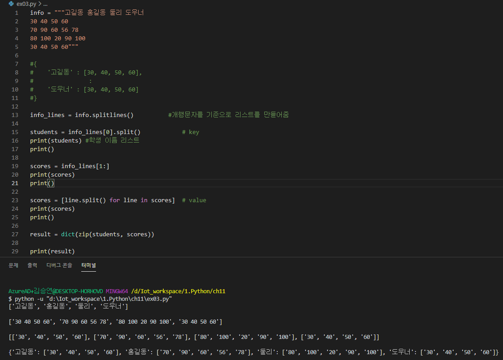
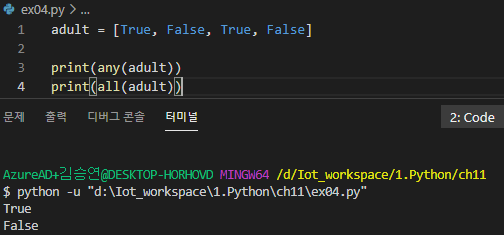
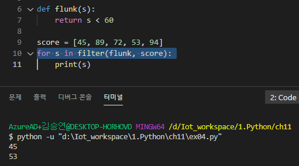

# 컬렉션 관리

## 컬렉션 관리 함수

### zip

* zip(시퀸스1, 시퀸스2) -> [(값1, 값2), ...]
* 한번만 쓸 수 있음. (루프를 한번이라도 하면 더이상 읽기 불가능)
* 때문에 처음부터 list로 변환시켜서 사용한다. (자주 사용하기 위함)
* 시퀸스의 길이가 다른 경우 가장 짧은 시퀸스의 길이에 맞춤.
* 

### enumerate

* enumerate(시퀸스[, start])
* 시퀸스의 인덱스와 요소를 튜플로 묶어서 순회

### any(), all()

* any(시퀀스) : 시퀀스에 하나라도 True가 있으면 True 리턴
* all(시퀀스) : 시퀀스의 모든 요소가 True이면 True 리턴
* 

### 람다함수

* filter (판정함수, 시퀀스) - > 시퀀스 : 시퀀스의 각 요소를 판정함수에 전달하여 True를 리턴하는 요소로만 구성된 새로운 시퀀스 리턴
* 

